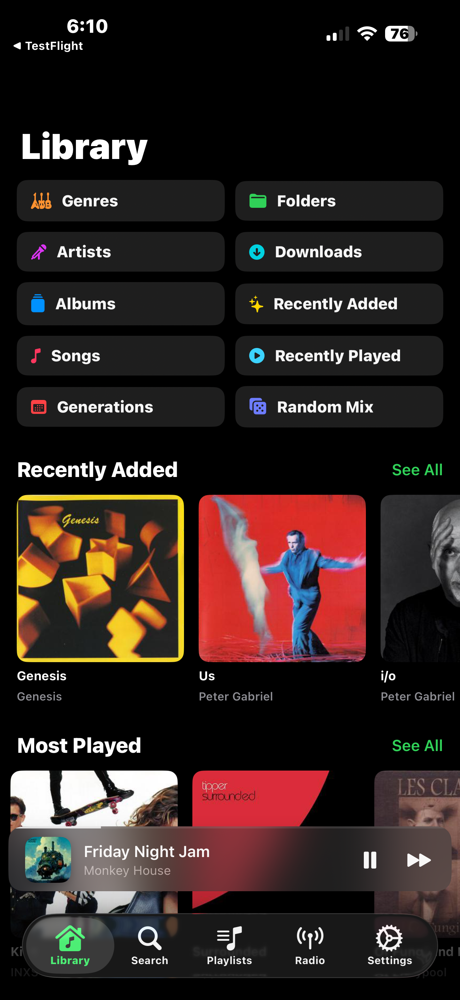
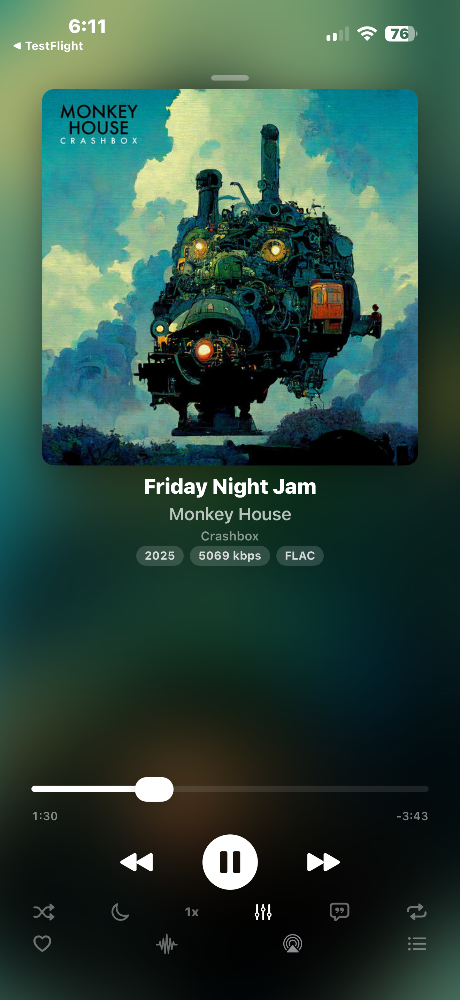
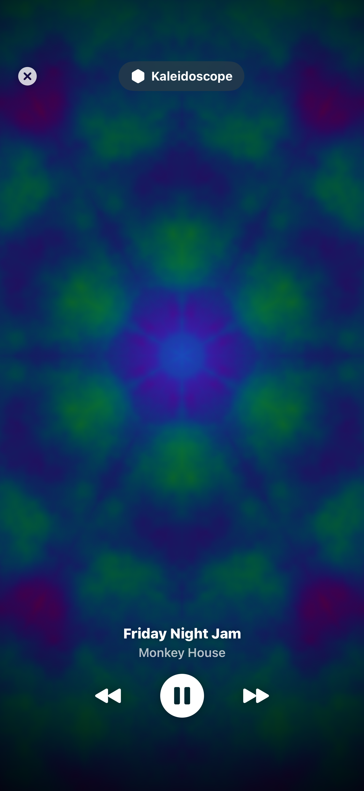
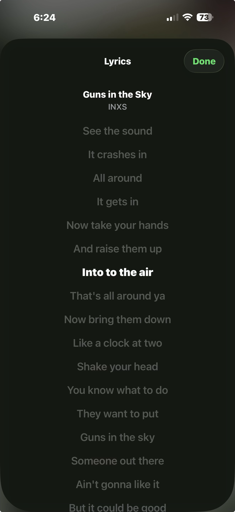
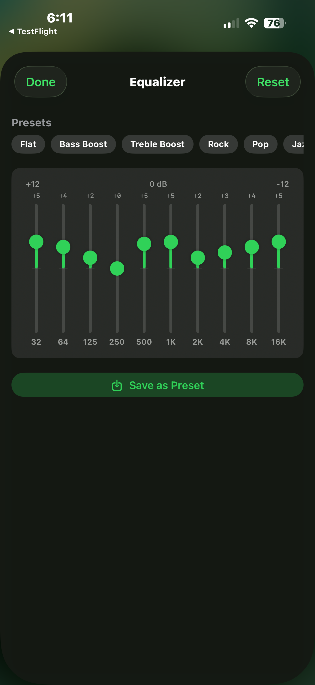
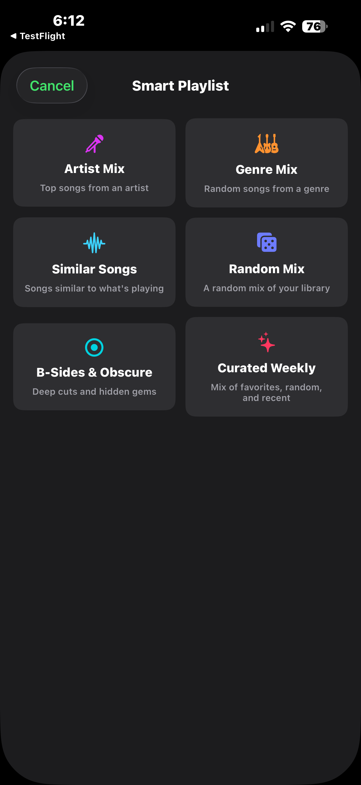
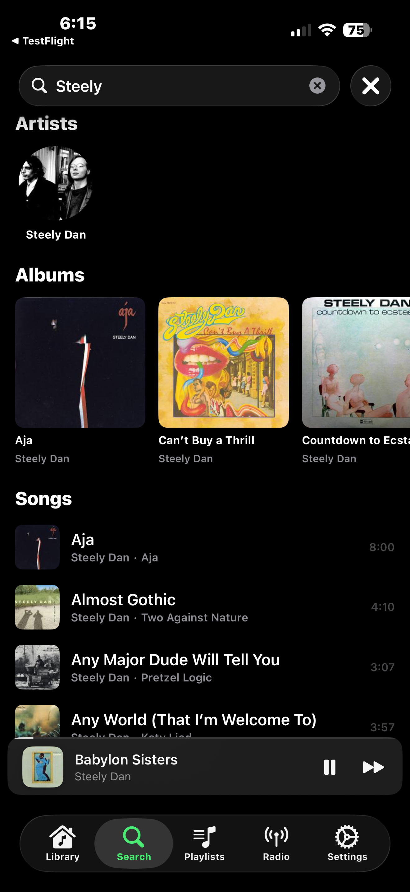

<p align="center">

```
 _   _  _____ ______ ______ ______ ______  _____ ___  ___ _____
| | | ||_   _|| ___ \| ___ \|  _  \| ___ \|  _  ||  \/  ||  ___|
| | | |  | |  | |_/ /| |_/ /| | | || |_/ /| | | || .  . || |__
| | | |  | |  | ___ \|    / | | | ||    / | | | || |\/| ||  __|
\ \_/ / _| |_ | |_/ /| |\ \ | |/ / | |\ \ \ \_/ /| |  | || |___
 \___/  \___/ \____/ \_| \_||___/  \_| \_| \___/ \_|  |_/\____/
```

**A native iOS/macOS music player for Navidrome servers** ♪♫(◕‿◕)♫♪

[Website](https://vibrdrome.io) · [Privacy Policy](https://vibrdrome.io/privacy-policy) · [Issues](https://github.com/ddmoney420/vibrdrome/issues)

</p>

---

<h2 align="center">100% Vibe Coded &nbsp; ᕙ(⇀‸↼‶)ᕗ</h2>

<p align="center">
<code>human vision + AI code</code> powered by <a href="https://claude.ai/claude-code"><b>Claude Code</b></a>
</p>

This entire project was **vibe coded** — designed, directed, and shipped using [Claude Code](https://claude.ai/claude-code) (Anthropic's AI coding agent). Every line of Swift, every SwiftUI view, every CI pipeline, every pixel of the app icon — all generated by AI, all guided by a human with a vision.

**What does that mean?**
- A human ([@ddmoney420](https://github.com/ddmoney420)) directed the vision, made decisions, and tested on real devices
- An AI (Claude) wrote the code, debugged the issues, and iterated on the architecture
- The result is a real, functional, App Store-ready music player

**Want to contribute?** We'd love that. This project is open for development — whether you're a human, an AI, or somewhere in between. See [Contributing](#contributing) below.

---

<h2 align="center">Features &nbsp; (ﾉ◕ヮ◕)ﾉ*:・゚✧</h2>

```
  _____   _____      _      _____   _   _   ____    _____   ____
 |  ___| | ____|    / \    |_   _| | | | | |  _ \  | ____| / ___|
 | |_    |  _|     / _ \     | |   | | | | | |_) | |  _|   \___ \
 |  _|   | |___   / ___ \    | |   | |_| | |  _ <  | |___   ___) |
 |_|     |_____| /_/   \_\   |_|    \___/  |_| \_\ |_____| |____/
```

### Playback &nbsp; ♪～(´ε｀ )
- **Gapless playback** — AVQueuePlayer with lookahead for seamless transitions
- **Crossfade** — configurable 0-12s overlap between tracks using dual-player architecture
- **10-band equalizer** — parametric EQ with presets for all tracks (AVAudioEngine)
- **ReplayGain** — track/album volume normalization from server metadata
- **Playback speed** — 0.5x to 2.0x with pitch preservation
- **Sleep timer** — 15m to 2h or end-of-track with countdown display and volume fade
- **5-star ratings** — rate tracks from Now Playing, synced to your server
- **Smart queue** — auto-continues with similar songs when the queue runs out
- **Queue sharing** — save your current queue as a playlist
- **Haptic feedback** — on play/pause, skip, and star actions
- **Mini player** — capsule shape with spinning album art, progress ring, swipe left/right to skip
- **Jukebox mode** — play music through your server's speakers as a remote control
- **Volume slider** — visible on-screen volume control in Now Playing

### Library &nbsp; ♬♩♪♩
- **Library browsing** — artists, albums, songs, genres, playlists, and folder hierarchy
- **Artist radio** — continuous auto-play seeded from any artist or track
- **Smart playlists** — 6 auto-generated playlist types with Smart Playlists pill in Library
- **Search** — full-text search with recent search history
- **Tappable genre** — tap genre badge on Now Playing to browse genre albums
- **Inline download** — download button on every track row
- **Synced lyrics** — scrolling lyrics with seek-to-line
- **Artist top songs** — top tracks section on artist pages
- **Artist biography** — expandable About section from Last.fm/MusicBrainz
- **Similar artists** — horizontal scroll carousel on artist pages
- **Similar albums** — discover related albums at the bottom of album detail
- **Parallax album header** — full-bleed album art that shrinks/fades on scroll
- **Disc separators** — multi-disc albums show disc headers
- **Genre artwork** — album art thumbnails in genre browser
- **Decades view** — browse by era with album art cards
- **Play history** — track stats: today, this week, top artists, top albums
- **Playlist mosaic** — 2x2 album art grid for playlists without server artwork

### Offline & Downloads &nbsp; (⌐■_■)
- **Offline mode** — download songs, albums, and entire playlists
- **Offline playlists** — batch download with full metadata preservation
- **Cache management** — configurable size limits with LRU eviction (pinned playlists protected)
- **Offline star/scrobble queue** — stars, ListenBrainz, and Last.fm scrobbles queued offline, flushed on reconnect
- **Offline indicator** — banner when server is unreachable
- **Download badges** — green icon on downloaded tracks throughout the app

### Platform &nbsp; ᕦ(ò_óˇ)ᕤ
- **CarPlay support** — Now Playing with shuffle, repeat, Up Next queue, progress tracking, and auto-navigate on track start
- **Home screen widget** — Now Playing with album art blur, interactive controls (small/medium/large)
- **Siri Shortcuts** — "Play my favorites", "Play a random mix", and more
- **macOS native app** — NavigationSplitView sidebar, keyboard shortcuts, pop-out player
- **Internet radio** — streaming with station artwork (Navidrome 0.61+)
- **Multi-server support** — per-server Keychain credentials with server switching
- **Audio visualizer** — 18 audio-reactive Metal shader presets
- **Bookmarks** — save and resume positions in long tracks

### Customization &nbsp; ─=≡Σ((( つ◕ل͜◕)つ
- **Theming** — dark/light/system mode with 10 accent color themes
- **Customizable library** — reorder & show/hide pills and carousels, optional dock tabs for Artists, Albums, Songs, Genres, Favorites
- **Customizable Now Playing toolbar** — drag-to-reorder and show/hide Visualizer, EQ, AirPlay, Lyrics, Settings
- **Always-visible search** — search bars on all browse views (Albums, Artists, Genres, Playlists, Favorites)
- **Swipe actions** — swipe right to Play Next, swipe left to Add to Queue
- **Now playing indicator** — animated waveform on currently playing track in any list
- **Playlist sharing** — toggle public/private visibility for multi-user servers
- **iOS 26 Liquid Glass** — frosted glass effects on mini player, album buttons, toolbar
- **iOS 26 floating tab bar** — adaptive dock with iPad sidebar morph
- **Lossless badge** — shows in album detail for FLAC/ALAC/WAV albums
- **Per-track actions** — tappable heart, download icon, and inline "..." menu on every track
- **Library folder switching** — filter by music folder on multi-library servers
- **Tappable metadata** — tap song title, artist, album name, or album art on Now Playing to navigate; tappable artist on album detail
- **Text size picker** — Small, Default, Large, and Extra Large text options
- **Accessibility** — VoiceOver support, bold text, reduce motion, disable visualizer
- **Scrobbling** — automatic scrobble submission with offline queuing for ListenBrainz and Last.fm
- **ListenBrainz** — scrobble to ListenBrainz with token authentication
- **Discord Rich Presence** — show what you're listening to on Discord (macOS)
- **Apple Watch** — companion app with playback controls, queue, library, sleep timer
- **AirPlay 2** — multi-room streaming via native AVPlayer integration

---

<h2 align="center">Screenshots</h2>

<p align="center">




</p>
<p align="center">



</p>

---

## Requirements

- Xcode 16+ (Swift 6.0)
- iOS 17.0+ / macOS 14.0+ / watchOS 11.0+
- A Navidrome server (or any Subsonic API-compatible server)

## Tech Stack

| Layer | Technology |
|---|---|
| Language | Swift 6 (strict concurrency) |
| UI | SwiftUI |
| Persistence | SwiftData |
| Audio | AVQueuePlayer (gapless), AVPlayer (crossfade), AVAudioEngine (EQ) |
| CarPlay | CPTemplate |
| Build System | XcodeGen |
| Image Loading | NukeUI (with disk caching) |
| Credentials | KeychainAccess |

## Build Instructions

```bash
# Prerequisites: Xcode 16+, XcodeGen (brew install xcodegen)

# Generate Xcode project
make generate

# Build
make build-ios     # iOS Simulator
make build-macos   # macOS native

# Test
make test

# Lint
make lint
```

## Architecture &nbsp; (⌐■_■)

```
App/                 App entry, AppState singleton, Theme
CarPlay/             CarPlay scene delegate and template manager
Core/
  Audio/             AudioEngine (3 backends), EQEngine, CrossfadeController,
                     SleepTimer, NowPlayingManager, RemoteCommandManager
  Downloads/         Background URLSession download manager, CacheManager
  Networking/        SubsonicClient, auth, models, endpoints, OfflineActionQueue
  Persistence/       SwiftData models (DownloadedSong, OfflinePlaylist, PendingAction, etc.)
Features/            SwiftUI views organized by feature
  Library/           Artist, album, song, genre, and folder browsing
  Player/            Now playing, mini player, lyrics, visualizer
  Playlists/         Playlist management and smart playlists
  Radio/             Internet radio stations
  Search/            Global search
  Settings/          Server config, appearance, playback, EQ settings
  Visualizer/        Metal shader-based audio visualizer
  Downloads/         Download management UI
Shared/              Reusable components (TrackRow, AlbumCard, StarButton) and extensions
```

### Playback Architecture

Two playback topologies, with inline EQ applied orthogonally via MTAudioProcessingTap:

```
Topology Selection:
1. Crossfade  — crossfadeDuration > 0   -->  Dual AVPlayer with volume ramps
2. Gapless    — crossfadeDuration == 0  -->  AVQueuePlayer with lookahead

EQ (optional, works with either topology):
   eqEnabled  -->  10-band parametric EQ via MTAudioProcessingTap on AVPlayerItem
```

`AudioEngine.shared` is the single facade. All UI, CarPlay, and remote commands talk only to AudioEngine — never to backends directly.

---

<h2 align="center">Contributing &nbsp; ᕙ(⇀‸↼‶)ᕗ</h2>

<p align="center">

```
 __     __  ___   ____    _____      ____    ___    ____    _____   ____
 \ \   / / |_ _| | __ )  | ____|    / ___|  / _ \  |  _ \  | ____| |  _ \
  \ \ / /   | |  |  _ \  |  _|     | |     | | | | | | | | |  _|   | | | |
   \ V /    | |  | |_) | | |___    | |___  | |_| | | |_| | | |___  | |_| |
    \_/    |___| |____/  |_____|    \____|  \___/  |____/  |_____| |____/
```

</p>

Contributions are welcome and encouraged! This is a community project — whether you want to fix a bug, add a feature, improve the UI, or just clean up some code, we'd love to have you.

**How to contribute:**

1. Fork the repo
2. Create a feature branch (`git checkout -b my-feature`)
3. Run `make lint` before committing
4. Open a PR with a description of what you changed and why

**Ideas for contributions:**
- New EQ presets
- Additional themes and accent colors
- Playlist import/export
- Widget support
- Localization / translations
- Performance optimizations
- Bug fixes (check [Issues](https://github.com/ddmoney420/vibrdrome/issues))

No contribution is too small. Even fixing a typo helps. ¯\\\_(ツ)\_/¯

---

## Other Vibrdrome Apps ヽ(>∀<)ノ

| Platform | Link |
|----------|------|
| iOS / macOS | You're here! |
| Android | [GitHub](https://github.com/ddmoney420/vibrdrome-android) |
| Web | [web.vibrdrome.io](https://web.vibrdrome.io) / [GitHub](https://github.com/ddmoney420/vibrdrome-web) |

---

## (♥‿♥) Community

- **Website:** [vibrdrome.io](https://vibrdrome.io)
- **Discord:** [Join the server](https://discord.gg/9q5uw3CfN)
- **Email:** [vibrdrome@gmail.com](mailto:vibrdrome@gmail.com)
- **GitHub Issues:** [Report bugs or request features](https://github.com/ddmoney420/vibrdrome/issues)

---

## License

This project is licensed under the **MIT License** — see the [LICENSE](LICENSE) file for details.

You're free to use, modify, and distribute this software. Your music stays yours, and the code stays open.

---

<p align="center">
  <b>Built with vibes, shipped with love</b>
  <br>
  ASCII art powered by <a href="https://github.com/ddmoney420/moji">moji</a>
  <br><br>
  <a href="https://vibrdrome.io">vibrdrome.io</a>
</p>
